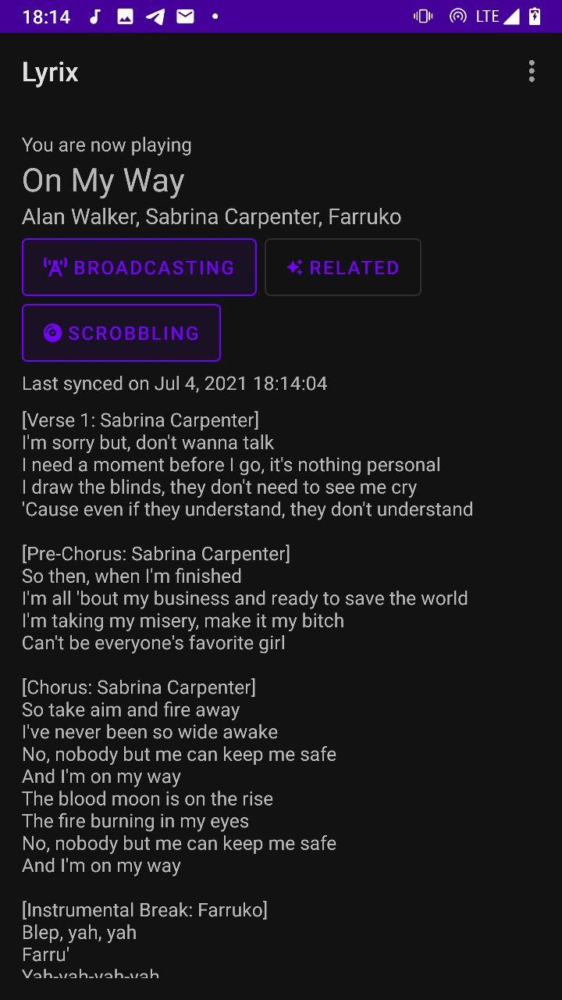

    

<h2 align="center">Lyrix Android</h2>

  

    A simple, tiny, powerful lyrics provider for android, built with Lyrix
     
    <a href="https://github.com/lyrix-music/cli/issues/new">Report bug</a>
    ·
    <a href="https://github.com/lyrix-music/cli/issues/new">Request feature</a>
  

    

Getting Started
---------------

The Lyrix Android client is experimental, and is ready for testers.
Early testers can get started by grabbing
the APK from [releases][lyrix-releases].

Install the `*.apk` and complete the login to start using
Lyrix right away.

License
-------
This [project][lyrix] is licensed under the MIT License.
See [LICENSE][license] for more information.

[lyrix]: https://github.com/lyrix-music/android
[lyrix-releases]: https://github.com/lyrix-music/android/releases/tag/continuous
[license]: ./LICENSE
